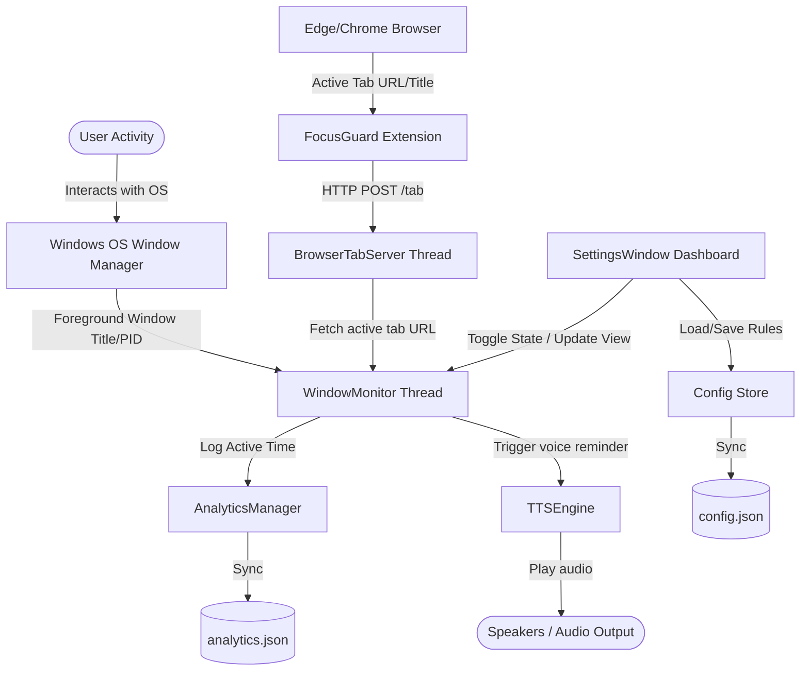

# 🛡️ FocusGuard
**A Premium Desktop Distraction Blocker & Focus Tracker**

FocusGuard is a Python-based desktop application (built with PyQt6) designed to monitor user activity, track time spent on productive vs. distracting applications, and provide customizable spoken audio reminders using advanced Text-to-Speech (TTS) engines. It features a dedicated browser extension for fine-grained website tracking and runs silently in the system tray as a background service.

---

## 🗺️ Architectural Overview

FocusGuard runs a multi-threaded desktop application that interacts with browser extensions and operating system APIs to monitor active windows, maintain persistent logs, and speak motivational or corrective phrases.



---

## 🎯 Core Features & Architecture

### 1. Active Window Monitoring
*   **Foreground Window Hook**: The [WindowMonitor](file:///f:/New%20folder/FocusGuard/monitor.py#L23) thread runs continuously in the background, polling Windows API functions `GetForegroundWindow` and `GetWindowThreadProcessId` via `win32gui` and `win32process` every second.
*   **Process Name & Title Extraction**: Resolves target process filenames (e.g., `chrome.exe`, `code.exe`) via the `psutil` library.
*   **Rule Matching Engine**:
    *   **Process-level Match**: Checks if the active `.exe` process name contains any keywords specified in "Good Apps" or "Bad Apps" configurations.
    *   **Browser-level Match**: When a browser process gains focus, the monitor queries the local tab server for precise tab coordinates instead of matching the generic browser application title.

### 2. Browser Extension Synchronization
*   **Local HTTP Server**: [BrowserTabServer](file:///f:/New%20folder/FocusGuard/browser_server.py#L28) runs an asynchronous `aiohttp` web server in a daemon thread on `http://127.0.0.1:7890`.
*   **Extension Messages**: The custom Edge/Chrome [FocusGuard Extension](file:///f:/New%20folder/FocusGuard-Extension/manifest.json) tracks window focus changes, active tab switching, and navigation changes.
*   **Endpoint `/tab` (POST)**: Receives `{ "url": "...", "title": "..." }` requests from the extension background script.
*   **Endpoint `/status` (GET)**: Exposes the current URL tracking status and currently matched rules to the browser popup.
*   **URL-level Filtering**: Allows separating productive URLs (e.g., `github.com`) from distracting ones (e.g., `youtube.com`) even though they reside under the same web browser process.

### 3. Dynamic Text-to-Speech Engine
The [TTSEngine](file:///f:/New%20folder/FocusGuard/tts_engine.py#L278) supports four customizable modes of speech generation, using hash-based local caching in `FocusGuard/tts_cache` to ensure instant audio playback without lags or repeated API hits:
1.  **Kokoro TTS (Local, High Quality)**: Integrates Kokoro-82M offline TTS using ONNX runtime and SoundFile.
    *   Automatically downloads model weights (`kokoro-v1.0.int8.onnx`) and voice bins (`voices-v1.0.bin`) on first run.
    *   Uses thread execution constraints to prevent CPU utilization spikes.
    *   Supports multiple natural sounding American (e.g., `heart`, `sarah`, `michael`) and British (e.g., `emma`, `george`) voices.
2.  **Edge-TTS (Online, Neural)**: Communicates with Microsoft's high-quality cloud neural voices (e.g., `Aria`, `Guy`, `Jenny`).
3.  **Google Gemini Flash TTS**: Generates audio streams utilizing `gemini-2.5-flash-preview-tts` (requires `GEMINI_API_KEY`).
4.  **Local TTS (Offline Default)**: Leverages native platform engines through `pyttsx3` if no internet access or custom configurations are available.

### 4. Rolling Real-Time Analytics
*   **Second-Accurate Metrics**: Active seconds are continuously written to the [AnalyticsManager](file:///f:/New%20folder/FocusGuard/analytics.py#L12) which flushes logs every 60 seconds into [analytics.json](file:///f:/New%20folder/FocusGuard/analytics.json).
*   **30-Day Auto Pruning**: Older logs are automatically pruned to maintain a lightweight storage footprint.
*   **PyQt Custom Visuals**: The [AnalyticsChart](file:///f:/New%20folder/FocusGuard/settings_window.py#L383) dynamically draws progress bars illustrating total productive focus time (Green) vs. distraction time (Red).

### 5. System Integration & Autostart
*   **Windows Startup Registry**: Writes or deletes system execution strings targeting `pythonw.exe` inside `HKEY_CURRENT_USER\Software\Microsoft\Windows\CurrentVersion\Run`.
*   **System Tray Control**: Stays active in the system tray when dashboard window is closed, showing rich notifications (balloon messages) on distraction timeouts, active tooltips, and context menus to pause/resume blocker enforcement.

---

## 📁 Codebase Directory Layout

```
FocusGuard/
│
├── launcher.py               # Application bootstrapper with crash logging
├── main.py                   # Entry point; tray initialization & Qt event loop
├── monitor.py                # Background window monitor thread (polls active windows)
├── browser_server.py         # Thread-safe aiohttp HTTP server on port 7890
├── config.py                 # Registry startup, defaults, loading/saving config
├── config.json               # Configured blocker rules, intervals, and phrase databases
├── tts_engine.py             # TTS client supporting Kokoro, Edge-TTS, Gemini, and pyttsx3
├── analytics.py              # Log manager that records and processes app usage metrics
├── analytics.json            # Time tracking storage (productive vs distraction logs)
├── settings_window.py        # PyQt6 dashboard interface, custom charts, rule lists
│
└── FocusGuard-Extension/    # Manifest V3 browser extension directory
    ├── manifest.json         # Extension configuration, host permissions, and scripts
    ├── background.js         # Event listener worker that POSTs URLs to desktop app
    ├── popup.html            # Mini browser popup interface
    └── popup.js              # Script polling /status for local desktop app sync
```

---

## 🛠️ System Components & APIs

### 1. Bootstrapper & Error Handling: [launcher.py](file:///f:/New%20folder/FocusGuard/launcher.py)
A lightweight wrap-around runner executing the main PyQt application. In the event of a critical unhandled exception, it dumps the stack trace into `FocusGuard/crash.log` to simplify headless debugging.

### 2. Main Entry Point: [main.py](file:///f:/New%20folder/FocusGuard/main.py)
*   Implements `app.setQuitOnLastWindowClosed(False)` to guarantee headless persistence when the settings window is closed.
*   Invokes `make_tray_icon` to draw a dynamic canvas gradient icon representing the running application state (vibrant purple for active, muted gray for paused).
*   Prefetches and pre-generates TTS cache arrays for all configured phrases concurrently on startup.

### 3. Window Tracker: [monitor.py](file:///f:/New%20folder/FocusGuard/monitor.py)
*   Uses `win32gui.GetForegroundWindow()` to access the handle (HWND) of the currently active GUI window.
*   Calls `win32process.GetWindowThreadProcessId(hwnd)` to extract the Process ID (PID).
*   Utilizes `psutil.Process(pid).name()` to identify the executable.
*   Calculates focus durations and fires signals to play cached voice alerts via the audio mixer.

### 4. Local Web Synchronizer: [browser_server.py](file:///f:/New%20folder/FocusGuard/browser_server.py)
*   Hosts a lightweight asynchronous server.
*   Implements thread-safe resource locks (`threading.Lock`) over tab URL and title strings to allow concurrent access by both the browser connection worker and the window monitor poll loop.

### 5. Config Store: [config.py](file:///f:/New%20folder/FocusGuard/config.py)
*   Maintains configurations in [config.json](file:///f:/New%20folder/FocusGuard/config.json).
*   Includes built-in schema migration heuristics, converting legacy configurations (like mapping `blocked_apps` to `bad_apps`) seamlessly on launch.
*   Provides [is_autostart_enabled()](file:///f:/New%20folder/FocusGuard/config.py#L45) and [set_autostart()](file:///f:/New%20folder/FocusGuard/config.py#L63) functions to write the start script path to the Windows registry.

### 6. Audio Engine: [tts_engine.py](file:///f:/New%20folder/FocusGuard/tts_engine.py)
*   Initializes the `pygame.mixer` to run in a separate audio playback channel.
*   Generates cache file hashes based on the MD5 sum of: `{phrase}|||{voice}|||{use_htts}|||{use_gemini}|||{use_kokoro}`.
*   Handles offline audio generation fallbacks: if Kokoro fails, it attempts Gemini, then Edge-TTS, and finally falls back to local platform-native speech synthesis (`pyttsx3`).

### 7. UI Dashboard: [settings_window.py](file:///f:/New%20folder/FocusGuard/settings_window.py)
*   Built entirely on top of PyQt6 widgets styling using a modern, dark CSS style sheet layout.
*   Features custom canvas widgets:
    *   **ToggleSwitch**: An animated toggle using `QPropertyAnimation` for state switching transitions.
    *   **AnalyticsChart**: A custom-drawn chart plotting daily metrics, computing bar widths relative to total tracked time.
*   Features inline configuration interfaces to quickly add app rules, delete keywords, edit TTS intervals, and select active voice actors.

---

## ⚡ Setup & Running Developer Instructions

### Prerequisites
*   **Operating System**: Windows 10 or 11 (required due to native Win32 window polling APIs and registry integrations).
*   **Python Version**: Python 3.10+ is recommended.

### 1. Installation
Clone the repository and install all dependencies:
```bash
pip install PyQt6 pywin32 psutil aiohttp pygame pyttsx3 edge-tts google-genai kokoro-onnx soundfile onnxruntime
```

*Note: If you have a GPU and wish to accelerate local Kokoro TTS synthesis, install `onnxruntime-gpu` instead of standard `onnxruntime`.*

### 2. Running the Application
To run with standard terminal outputs:
```bash
python main.py
```
To run headlessly without a terminal window popping up:
```bash
pythonw launcher.py
```

### 3. Setting Up the Browser Extension
1.  Open Microsoft Edge or Google Chrome.
2.  Navigate to extension settings (`edge://extensions` or `chrome://extensions`).
3.  Enable **Developer Mode** (top-right toggle).
4.  Click **Load Unpacked** and select the [FocusGuard-Extension](file:///f:/New%20folder/FocusGuard-Extension) directory.
5.  Pin the extension icon to the toolbar. The popup will display "Connected" when the FocusGuard desktop application is running.

---

## ⚙️ Configuration File Schema ([config.json](file:///f:/New%20folder/FocusGuard/config.json))

The settings window writes values to [config.json](file:///f:/New%20folder/FocusGuard/config.json) using the following format:
```json
{
  "bad_apps": [
    {
      "name": "YouTube",
      "type": "browser",
      "keywords": ["youtube.com", "youtube"]
    }
  ],
  "good_apps": [
    {
      "name": "VS Code",
      "type": "process",
      "keywords": ["code.exe"]
    }
  ],
  "bad_phrases": [
    "Hey! Stop scrolling and get back to work!"
  ],
  "good_phrases": [
    "Great focus! Keep it up."
  ],
  "reminder_interval": 2,
  "tts_voice": "kokoro-af_heart",
  "enabled": true,
  "use_htts": false,
  "use_gemini": false,
  "use_kokoro": true,
  "gemini_voice": "Puck",
  "gemini_api_key": "",
  "autostart": false
}
```

---

## 🧠 Guidelines for AI Agents & Developers

When modifying or expanding the application capabilities:
1.  **Preserve Win32 Threading Conventions**: PyQt UI changes must only be driven on the main GUI thread. Polling threads ([WindowMonitor](file:///f:/New%20folder/FocusGuard/monitor.py#L23)) and local HTTP workers ([BrowserTabServer](file:///f:/New%20folder/FocusGuard/browser_server.py#L28)) must use PyQt Signals to transmit status updates to the UI window.
2.  **API Key Safety**: Never commit API keys in [config.json](file:///f:/New%20folder/FocusGuard/config.json). Load secrets from environment variables or secure inputs inside the GUI dashboard.
3.  **Ensure Kokoro Optimizations**: Keep thread limitations (`opts.intra_op_num_threads = 2`) in [tts_engine.py](file:///f:/New%20folder/FocusGuard/tts_engine.py#L193) to prevent the local ONNX inference engine from locking all CPU cores.
4.  **Graceful Fallbacks**: Always maintain the fallback chains for TTS audio synthesis so that offline users or users without custom credentials can still get reminders smoothly.
